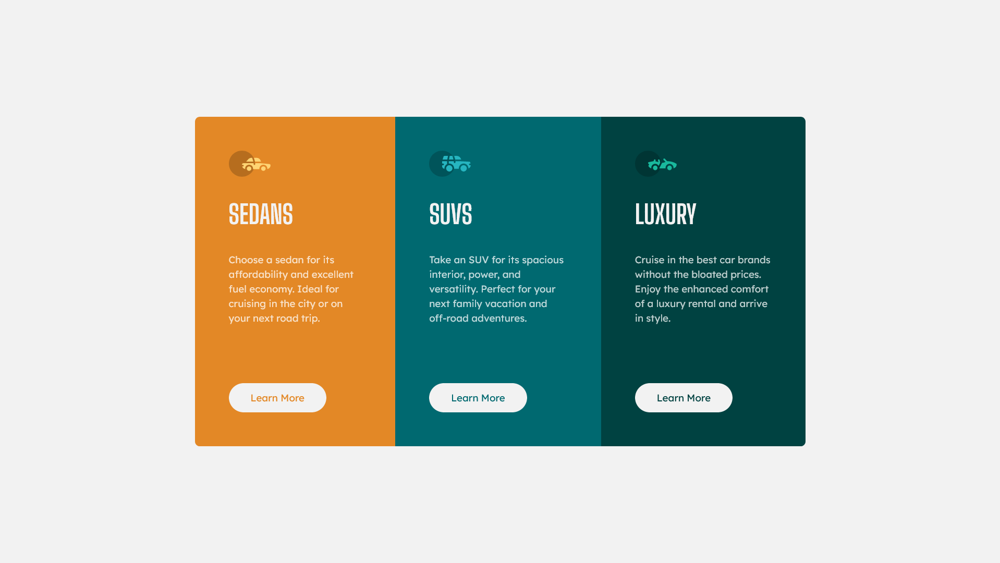

# Frontend Mentor - 3-Column Preview Card Component Solution

This is a solution to the [3-Column Preview Card Component Challenge on Frontend Mentor](https://www.frontendmentor.io/challenges/3column-preview-card-component-pH92eAR2-). Frontend Mentor challenges help you improve your coding skills by building realistic projects. 

## Table of contents

- [Overview](#overview)
  - [The challenge](#the-challenge)
  - [Screenshot](#screenshot)
  - [Links](#links)
- [My process](#my-process)
  - [Built with](#built-with)
  - [What I learned](#what-i-learned)

## Overview

### The challenge

Users should be able to:

- View the optimal layout depending on their device's screen size
- See hover states for interactive elements

### Screenshot

### Links

- [Solution](https://www.frontendmentor.io/solutions/responsive-3column-preview-card-component-using-css-flex-grid-2GkNL9USJq)
- [Live Site](https://resplendent-horse-edd009.netlify.app/)

## My process

### Built with

- Love 💖
- Semantic HTML5 markup
- CSS custom properties
- Flexbox
- CSS Grid
- Mobile-first workflow

### What I learned

Nothing new this time, but it felt good to complete this challenge without a hitch! 